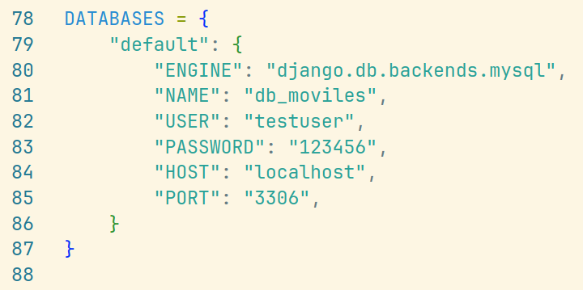

# WS PARA MOVILES 


## PASOS


1. clonar el repositorio
   ```
   git clone https://github.com/AngelAld/ws-moviles
   ```
2. Entorno virtual
   ```
   py -3 -m venv .venv
   ```

3. instalar dependencias
   ```
    pip install -r requirements.txt
   ```
4. realizar migraciones (revisa la configuración de tu base de datos en settings.py)
   ```
   python manage.py makemigrations
   python manage.py migrate
   ```
     * NOTA: no hacer lo de la bd por ahora, se manejará con SQLite para compartir la data temporalmente
   
5. correr el proyecto
   ```
   python manage.py runserver
   ```

6. Para ver las apis, puedes entrar a la documentación
   ```
   http://127.0.0.1:8000
   ```
